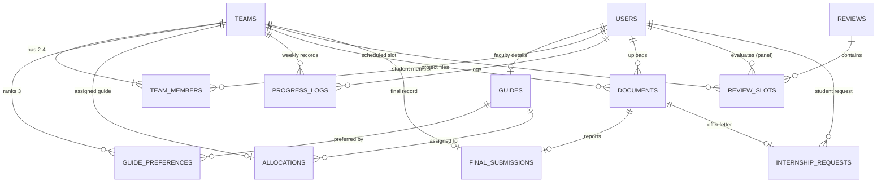

# CapstoneTrack — Project Brain & Single Source of Truth

---

## 1. Project Overview, Problem & Roles

### 1.1 Overview & Problem Statement
In higher education institutions, final-year capstone projects and internships are commonly mismanaged across disparate spreadsheets, email threads, and messaging groups. Key friction points include:
- **Biased / manual guide allocation**: Unequal supervision distribution across faculty; student preferences ignored or handled arbitrarily.
- **Review scheduling chaos**: Double-booking faculty, student timetable clashes, and lack of clarity on review venues/deadlines.
- **Lost logbooks**: Last-minute fabrication of weekly progress reports instead of consistent continuous evaluation.
- **Lack of coordinator visibility**: Academic coordinators have no real-time dashboard or heatmap to identify lagging teams before final submissions.

**CapstoneTrack** replaces this fragmented process with an integrated, deterministic, and delightful platform.

### 1.2 Hierarchy & Role Matrix
Hierarchy (Bottom to Top): **Students $\rightarrow$ Guides $\rightarrow$ Coordinator**, with an independent **Review Panel** for milestone evaluations.

1. **Student** (Base):
   - Forms or joins a team (2 to 4 students, typical size 3) using a 6-character team join code.
   - Team lead locks the team roster and ranks exactly 3 distinct faculty preferences.
   - Submits weekly progress logs (work completed, planned objectives, blockers).
   - Uploads milestone deliverables (Synopsis, SRS, Design Report, Presentation, Final Code).
   - Tracks review dates and submits the semester-end final capstone record.
   - (Stretch) Submits internship approval requests with offer letter attachments.

2. **Guide** (Faculty Supervisor):
   - Supervises multiple teams concurrently up to their individual maximum capacity ($C(g) \in [1, 10]$).
   - Reviews and grades/signs off on weekly progress logs (`approved` or `needs_changes`).
   - Views their assigned review slots and evaluations.
   - (Stretch) Reviews and recommends student internship requests.

3. **Coordinator** (Department Lead / Admin):
   - Single administrative authority above all guides.
   - Adjusts guide supervision quotas (`max_teams`).
   - Executes the automated guide allocation engine with transparent satisfaction metrics.
   - Performs manual allocation overrides with audit logs.
   - Creates review milestones and generates conflict-free evaluation schedules.
   - Real-time dashboard with KPI metrics, overdue logbook warnings, and a 12-week progress heatmap.
   - (Stretch) Final approval authority for internships.

4. **Review Panel** (Milestone Evaluator):
   - Faculty/external evaluators assigned to evaluate teams during scheduled review slots.
   - Read-only schedule visibility (and rubric scoring in stretch phase).

---

## 2. Technology Stack & Architectural Decisions

| Layer | Technology | Rationale |
|---|---|---|
| **Frontend** | React 18, Vite, React Router v6 | High-speed SPA routing, responsive state management, and modern component tree. |
| **3D & Animation** | Three.js, `@react-three/fiber`, `@react-three/drei`, GSAP ScrollTrigger | Persistent clay graduation cap on landing page driven by scroll progress (0 to 1); zero 3D overhead in dashboard. |
| **Styling** | Vanilla CSS Tokens & Claymorphism | 100% bespoke puffy 3D clay aesthetic with large radii, multi-layered inset/drop shadows, and pastel palettes without TailwindCSS overhead. |
| **Backend** | Python 3.10+ & FastAPI | High performance asynchronous API, strict Pydantic v2 schemas, and dependency-injected JWT RBAC. |
| **Persistence** | Supabase (PostgreSQL) / Async SQLAlchemy | Relational integrity, foreign keys, unique constraint guarantees (`UNIQUE(student_id)`), and versioned migration files in `/backend/migrations`. |
| **Auth** | JWT + Passlib (Bcrypt) | Stateless role verification in FastAPI dependencies (`require_role(...)`). |
| **File Storage** | Local `/uploads/` + PostgreSQL Metadata | Files partitioned by team on local disk; database maintains MIME, hash, size, and version metadata. |
| **Testing** | Pytest | Strict unit and integration tests for allocation matching and review conflict avoidance. |

---

## 3. Database Schema Specification

All migrations are tracked in `/backend/migrations/` as versioned SQL scripts.

### Table Details:
1. `users`: `id` (UUID PK), `email` (UNIQUE), `password_hash`, `full_name`, `role` (`student`, `guide`, `coordinator`, `panel`), `department`, `cgpa` (NUMERIC 3,2 for students), `created_at`.
2. `guides`: `id` (UUID PK), `user_id` (FK users UNIQUE), `specialisations` (TEXT[]), `max_teams` (INT, default 3), `created_at`.
3. `teams`: `id` (UUID PK), `code` (VARCHAR(6) UNIQUE), `name`, `project_title`, `lead_id` (FK users), `is_locked` (BOOL), `avg_cgpa`, `preference_submitted_at`, `created_at`.
4. `team_members`: `id` (UUID PK), `team_id` (FK teams), `student_id` (FK users UNIQUE — **guarantees 1 team per student**), `joined_at`.
5. `guide_preferences`: `id` (UUID PK), `team_id` (FK teams), `guide_id` (FK guides), `rank` (INT 1-3), `created_at`. Unique on `(team_id, rank)` and `(team_id, guide_id)`.
6. `allocations`: `id` (UUID PK), `team_id` (FK teams UNIQUE), `guide_id` (FK guides), `allocated_rank` (INT NULL), `is_manual_override` (BOOL), `allocated_at`.
7. `reviews`: `id` (UUID PK), `title`, `phase` (INT 1-3), `start_date`, `end_date`, `slot_duration_mins`, `is_active`, `created_at`.
8. `review_slots`: `id` (UUID PK), `review_id` (FK reviews), `team_id` (FK teams), `panel_user_id` (FK users), `room_or_link`, `start_time`, `end_time`, `status`.
9. `progress_logs`: `id` (UUID PK), `team_id` (FK teams), `student_id` (FK users), `week_number` (INT 1-16), `work_done`, `planned_next`, `blockers`, `status` (`submitted`, `approved`, `needs_changes`), `guide_feedback`, `reviewed_at`, `created_at`. Unique on `(team_id, week_number)`.
10. `documents`: `id` (UUID PK), `team_id` (FK teams), `review_id` (FK reviews NULL), `doc_type` (`synopsis`, `srs`, `report`, `presentation`, `code_zip`, `internship_offer`), `file_path`, `original_filename`, `file_size_bytes`, `mime_type`, `version`, `uploaded_by` (FK users), `uploaded_at`.
11. `final_submissions`: `id` (UUID PK), `team_id` (FK teams UNIQUE per semester), `semester`, `report_doc_id` (FK docs), `presentation_doc_id` (FK docs NULL), `git_repo_url`, `demo_url`, `status` (`draft`, `submitted`, `accepted`), `coordinator_feedback`, `submitted_at`.
12. `internship_requests`: `id` (UUID PK), `student_id` (FK users), `company_name`, `role_title`, `start_date`, `end_date`, `offer_doc_id` (FK docs), `guide_status`, `coordinator_status`, `guide_comment`, `coordinator_comment`, `created_at`.
13. `notifications`: `id` (UUID PK), `user_id` (FK users), `title`, `message`, `type`, `is_read`, `created_at`.

---

## 4. API Reference Summary

- `POST /api/v1/auth/login`: Issue JWT token with user object and role.
- `GET /api/v1/auth/me`: Validate JWT and return active profile.
- `POST /api/v1/auth/register-student`: Student self-registration.
- `POST /api/v1/teams`: Create team (sets creator as lead).
- `POST /api/v1/teams/join`: Join team by 6-char code (validates size $\le 4$ and student unassigned).
- `GET /api/v1/teams/my-team`: Active team details, members, locked status, preferences, allocation.
- `POST /api/v1/teams/my-team/lock`: Lead locks team (validates size between 2 and 4, computes `avg_cgpa`).
- `POST /api/v1/teams/my-team/preferences`: Submit 3 ranked guide preferences.
- `GET /api/v1/teams/guides-list`: List guides with domains and capacity.
- `POST /api/v1/allocation/run`: Coordinator runs deterministic matching algorithm.
- `GET /api/v1/allocation/results`: Summary metrics, guide load bars, and unallocated teams.
- `POST /api/v1/allocation/override`: Manual coordinator assignment override.
- `GET /api/v1/reviews`: List review milestones.
- `POST /api/v1/reviews/{id}/auto-schedule`: Run conflict-free slot scheduling.
- `GET /api/v1/reviews/{id}/slots`: Slot calendar with filters for team, guide, or panel.
- `PUT /api/v1/reviews/slots/{id}/reschedule`: Update slot with conflict check.
- `POST /api/v1/logs`: Submit weekly log.
- `GET /api/v1/logs/team/{id}`: Team logbook history.
- `PUT /api/v1/logs/{id}/review`: Guide approves or requests changes.
- `POST /api/v1/documents/upload`: Multi-part upload with 20MB limit and auto-versioning.
- `GET /api/v1/documents/team/{id}`: Document history.
- `GET /api/v1/documents/download/{id}`: Download file stream.
- `POST /api/v1/submissions`: Final semester project submission.
- `PUT /api/v1/submissions/{id}/status`: Coordinator approval/feedback.
- `GET /api/v1/coordinator/dashboard`: KPI cards, falling behind list, upcoming reviews.
- `GET /api/v1/coordinator/heatmap`: 12-week log status matrix for all teams.
- `PUT /api/v1/coordinator/guides/{id}/capacity`: Update guide max teams.

---

## 5. Algorithmic Specifications

### 5.1 Allocation Engine (`backend/allocation.py`)
1. **Preserve Manual Overrides**: Decrement guide capacity for pre-assigned teams.
2. **Prioritization**: Sort remaining locked teams by `avg_cgpa` DESC (or submission time ASC).
3. **Deterministic Tie-Breaking**: `(avg_cgpa DESC, preference_submitted_at ASC, created_at ASC, team_id)`.
4. **Matching Loop**:
   - For each team, evaluate preferences $r \in [1, 2, 3]$.
   - If guide $g_r$ has `remaining_capacity > 0`, allocate team to $g_r$ and decrement capacity.
   - If all 3 preferences are exhausted, mark team as `unallocated` and provide recommendations (guides sorted by highest remaining headroom).
5. **Metrics Output**: Choice satisfaction percentages (1st choice, 2nd choice, 3rd choice), unallocated count, and guide load distribution.

### 5.2 Review Scheduling Engine (`backend/scheduler.py`)
- Discretizes review dates into slots of `slot_duration_mins`.
- Assigns teams while checking:
  1. No team booked in overlapping slot.
  2. Team's allocated guide has no overlapping slot.
  3. Panel member has no overlapping slot.
  4. Room/link is not double-booked.
- Groups slots by guide to prevent fragmented faculty hours.

---

## 6. Claymorphism Design System & 3D Scroll Storytelling

### 6.1 Design Tokens
- **Background**: `#F2EFFE` (soft lavender/cream).
- **Cards**: Large radius (`32px`), no visible borders, puffy layered box-shadows.
- **Buttons**: Pill-shaped (`border-radius: 9999px`), lift on hover, scale down (`0.96`) and inset shadow on press.
- **Pills**: Mint (approved), Peach (pending), Coral (missing/behind).
- **Typography**: Poppins / Nunito for friendly rounded text; JetBrains Mono for bracketed technical tags.

### 6.2 Three.js 3D Scroll System (Landing Page)
- **Object**: Chubby procedural clay graduation cap (`HeroObject.jsx`) with mortarboard, skull cap, button, and dynamic drooping tassel.
- **Scroll Synchronization**: GSAP ScrollTrigger normalizes window scroll to $progress \in [0, 1]$, mapped to keyframe states in `src/three/scrollKeyframes.js`.
- **7 Storytelling Sections**:
  1. *Hero*: Giant faint outlined title, floating cap, bottom tagline.
  2. *Problem*: Cap drifts left, squashes/wobbles, turns stressed coral; word-by-word reveal.
  3. *Solution*: Cap centers and rotates; turns calming mint.
  4. *How It Works*: HUD arc with `[ TEAM ] [ GUIDE ] [ REVIEWS ] [ LOGS ] [ SUBMIT ]`.
  5. *Stats*: 3 illuminated metric columns (`1 click / ALLOCATION`, `0 clashes`, `100% VISIBILITY`).
  6. *Roles*: Cap splits into 4 orbiting pastel blobs and merges.
  7. *CTA*: Scales up with bounce in vibrant violet (`#6C47FF`); "Get Started" clay button.

---

## 7. Implementation Progress Checklist

- [x] **Phase 1**: Database schema & migrations, FastAPI auth with JWT & RBAC, realistic seed data generator
- [x] **Phase 2**: Team formation, 3-ranked preferences, allocation algorithm with Pytest suite
- [x] **Phase 3**: Review scheduling engine with conflict validation & Pytest suite
- [x] **Phase 4**: Weekly progress logs, file uploads with versioning, semester final submissions
- [x] **Phase 5**: Coordinator dashboard, overdue logbook alerts, 12-week progress heatmap
- [x] **Phase 6**: Claymorphism frontend for Student, Guide, Coordinator, and Panel portals
- [x] **Phase 7**: Landing page with persistent 3D clay graduation cap & GSAP scroll storytelling
- [x] **Phase 8**: Stretch features (Internship approval workflow, similarity check stub) & documentation

---

## 8. Key Decisions & Change Log
- **2026-10-06**: Phase 0 Architecture Approved. `brain.md` initialized. Supabase migration files established in `/backend/migrations/`.
- **Auth Strategy**: FastAPI acts as the single JWT gatekeeper with custom RBAC dependencies. Direct Supabase PostgREST access is locked down for data security.
